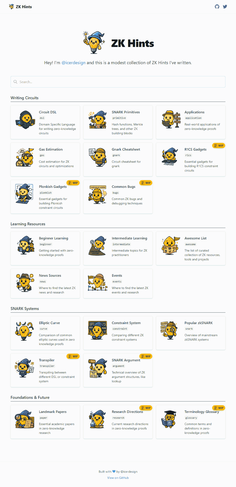

# ZK Wiki

A comprehensive resource hub for Zero-Knowledge Proofs (ZKP) technology, providing curated lists of educational materials, tools, events, and references.

## Features



## Project Structure

```
/
├── public/             # Static assets
├── src/
│   ├── components/     # React components
│   ├── data/           # Data files for resources and content
│   │   └── list/       # Resource list definitions
│   ├── layouts/        # Page layouts
│   └── pages/          # Astro pages
└── .github/workflows/  # GitHub Actions for deployment
```

## Development

```bash
# Install dependencies
yarn

# Start development server
yarn dev

# Build for production
yarn build

# Preview production build
yarn preview
```

## Deployment

The site is automatically deployed to GitHub Pages when changes are pushed to the main branch.

## Contributing

Contributions are welcome! To add or update resources:

1. Find the appropriate file in `src/data/`
2. Add your resource following the existing format
3. Submit a pull request with your changes

## License

MIT
